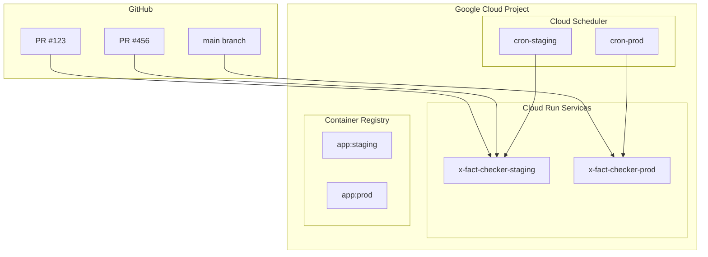

# Fact-Checker Infrastructure

このディレクトリには、fact-checkerアプリケーションのTerraformインフラストラクチャ設定が含まれています。

## 概要

このインフラストラクチャは、Issue #31の要件に基づいて設計されており、PRごとに検証環境を作成できるシステムを提供します。

### アーキテクチャ



## モジュール構成

### 1. secrets モジュール
- Secret Managerでの機密情報管理
- 環境別のSecret命名規則
- サービスアカウントへのアクセス権限付与

### 2. fact-checker-app モジュール
- Cloud Runサービスの設定
- サービスアカウントとIAM設定
- ヘルスチェックとスケーリング設定
- 環境変数とSecret統合

### 3. scheduler モジュール
- Cloud Schedulerジョブの設定
- 認証付きHTTPリクエスト
- 環境別のスケジュール設定

## 環境設定

### 本番環境 (main ブランチ)
- `x-fact-checker-prod`
- 最小インスタンス数: 1
- 最大インスタンス数: 20
- CPU制限: 2
- メモリ制限: 1Gi
- Cronスケジュール: 9-21時 毎時実行

### ステージング環境 (その他のブランチ)
- `x-fact-checker-staging`
- 設定可能なリソース制限
- デバッグログレベル
- カスタマイズ可能なCronスケジュール

## 安全弁システム

GitHub Actionsワークフローには3段階の安全弁が実装されています：

1. **ENABLE_DOCKER_BUILD**: Dockerイメージのビルドを制御
2. **ENABLE_TERRAFORM_APPLY**: Terraformの実際の適用を制御
3. **ENABLE_PRODUCTION_DEPLOY**: 本番環境への展開を制御

## 使用方法

### 1. 初期設定
```bash
cd infrastructure
terraform init
```

### 2. 設定の検証
```bash
terraform validate
```

### 3. 実行計画の確認
```bash
terraform plan
```

### 4. インフラストラクチャの適用
```bash
terraform apply
```

## 必要な変数

以下の変数を設定する必要があります：

- `gcp_project_id`: GCPプロジェクトID
- `branch_name`: ブランチ名（環境判定用）
- `region`: GCPリージョン（デフォルト: asia-northeast1）

## Secret管理

以下のSecretがSecret Managerで管理されます：

- OpenAI API Key
- Vector Store ID
- Slack Bot Token
- Slack Signing Secret
- Slack Channel ID
- X (Twitter) API認証情報
- Cron Secret

## 注意事項

- 本番環境への展開には`ENABLE_PRODUCTION_DEPLOY=true`の設定が必要
- 全ての安全弁が無効化されている場合、実際のリソース作成は行われません
- 環境別のSecret命名により、本番とステージングの設定が分離されています
